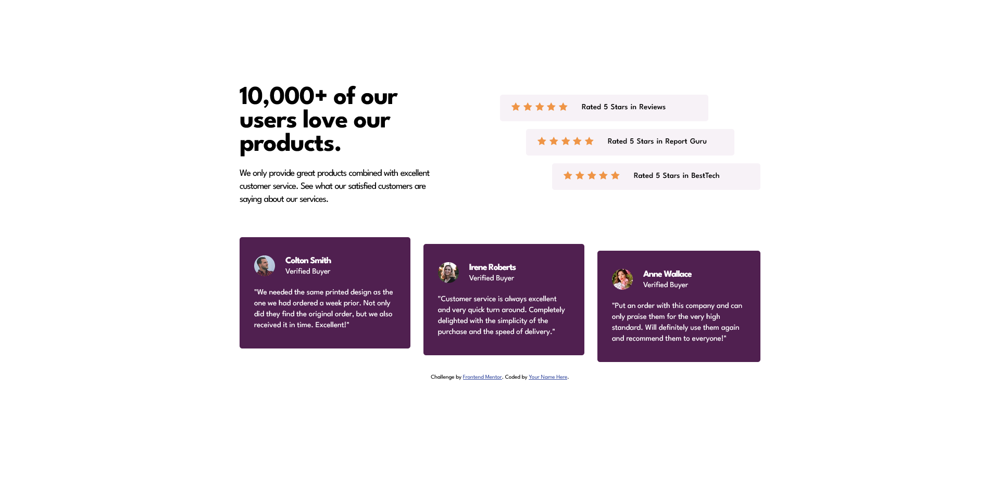
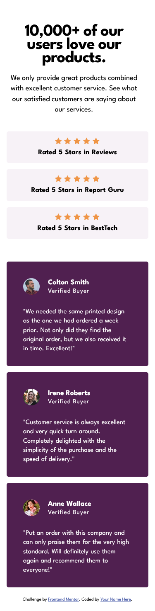

# Frontend Mentor - Social proof section solution

This is a solution to the [Social proof section challenge on Frontend Mentor](https://www.frontendmentor.io/challenges/social-proof-section-6e0qTv_bA). Frontend Mentor challenges help you improve your coding skills by building realistic projects.

## Table of contents

- [Overview](#overview)
  - [The challenge](#the-challenge)
  - [Screenshot](#screenshot)
  - [Links](#links)
- [My process](#my-process)

  - [Built with](#built-with)
  - [What I learned](#what-i-learned)

- [Author](#author)

**Note: Delete this note and update the table of contents based on what sections you keep.**

## Overview

### The challenge

Users should be able to:

- View the optimal layout for the section depending on their device's screen size

### Screenshot

| Desktop version                                     |                   Mobile Version                   |
| --------------------------------------------------- | :------------------------------------------------: |
|  |  |
|     |     |

### Links

- Solution URL: [Solution URL here](https://github.com/mnsa2020/social-proof-section-master)
- Live Site URL: [Live Site URL here](https://mnsa2020.github.io/social-proof-section-master/)

## My process

### Built with

- Semantic HTML5 markup
- CSS custom properties
- Grid
- SASS

### What I learned

- View the optimal layout for the section depending on their device's screen size

## Author

- Website - [Mohamed Ahmed](https://github.com/mnsa2020)
- Frontend Mentor - [Mohamed Ahmed](https://www.frontendmentor.io/profile/mnsa2020)
